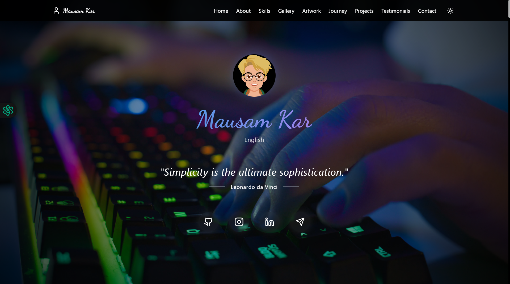

# My Portfolio (Version 3)

<div align="center">
  
  
  <h3>✨ A Modern, Interactive Portfolio Built with React & TypeScript</h3>
  
  <p>
    
    
    
    
    
    
    
  </p>
</div>

## 📑 Table of Contents
- [✨ Features](#-features)
- [🚀 Live Demo](#-live-demo)
- [🛠️ Tech Stack](#-tech-stack)
- [📂 Sections](#-sections)
- [⚙️ Installation](#-installation)
- [🤝 Contact](#-contact)

## ✨ Features
- 🎨 Fully responsive design
- 🌓 Dark/Light mode toggle
- ⚡ Smooth animations & transitions
- 📱 Mobile-first approach
- 🔄 Dynamic content loading
- 🎯 Interactive UI elements
- 🌐 SEO optimized
- 🚀 Fast performance

## 🚀 Live Demo
<div align="center">
  <h3>Experience the portfolio live</h3>
  <a href="https://yourportfolio.vercel.app/">
    
  </a>
</div>

## 🛠️ Tech Stack

### Frontend Technologies
- **ReactJS** - Modern UI library for building dynamic interfaces
- **TypeScript** - Type-safe JavaScript for better development experience
- **JavaScript** - Core programming language

### Styling & Animations
- **Tailwind CSS** - Utility-first CSS framework
- **Framer Motion** - Smooth animations and transitions
- **Custom CSS** - Personalized styling

### Deployment & Hosting
- **Vercel** - Global edge network deployment

### Integrations
- **Telegram** - Direct communication channel
- **GitHub API** - Live repository data

## 📂 Sections

<div align="center">
  <table>
    <tr>
      <td>🎯 Hero Section</td>
      <td>👤 About Me</td>
      <td>🎓 Qualifications</td>
    </tr>
    <tr>
      <td>📜 Certifications</td>
      <td>💻 Skills</td>
      <td>📚 Education</td>
    </tr>
    <tr>
      <td>📝 Notes</td>
      <td>🖼️ Gallery</td>
      <td>🎨 Artwork</td>
    </tr>
    <tr>
      <td>🗺️ Journey</td>
      <td>💡 Inspirations</td>
      <td>🎯 Future Goals</td>
    </tr>
    <tr>
      <td>😊 Fun Facts</td>
      <td>📰 Blog</td>
      <td>💬 Testimonials</td>
    </tr>
  </table>
</div>

## ⚙️ Installation

```bash
# Clone the repository
git clone https://github.com/Mausam5055/My-Portfolio-V-03.git
cd My-Portfolio-V-03

# Install dependencies
npm install

# Start development server
npm run dev
```

## 🤝 Contact

<div align="center">
  <a href="https://github.com/Mausam5055">
    
  </a>
  <a href="https://www.linkedin.com/in/mausam-kar-6388861a7/">
    
  </a>
  <a href="https://t.me/yourusername">
    
  </a>
</div>

---

<div align="center">
  <p>Made with ❤️ by Mausam Kar</p>
  <p>© 2024 All rights reserved</p>
</div>
